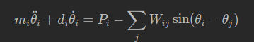

# The second-order Kuramoto model

## 🧩 Overview

The code implements the second-order Kuramoto equation to simulate high-voltage power grids:



In this model, each oscillator describes a generator or consumer, with inertia $m_i$, damping $d_i$, $P_i$ power injection, $\theta_i$ phase angle, $A_{ij}$ connection matrix.

## Expected network format

Both the nodes and the edges have to be provided.

The node format is a 4-column file
```
ID(int) | Self-Frequency(float) | Community Index(int) | Boolean Mask(bool)
```
- ID: node ID (starts from 1)
- Self-frequency: this is in fact the injected power, $P_i$, in the Kuramoto equation.
- Community Index: starts from 1, describes to which community the given node belongs
- Boolean Mask: a mask to force the self-frequency from the file or randomize it.
  
The edge format is also of 4-column:
```
ID1(int) | ID2(int) | Connection Weight(float) | Boolean Mask(bool)
```
- `ID1` and `ID2` are the source and target nodes
- Connection weight describes the importance of the connection between the two nodes
- Boolean Mask is used to implement more sophisticated dynamics

**Note:** ID starts from 0. This later should be changed to 0 due to better compatibility. Some for loops also start from 1. This has to be changed as well.
## ⚙️ Command Line Parameters

Run the simulation via:

```bash
./main [OPTIONS]
```

Below is a complete list of available parameters:

---

### 🧱 Network Configuration

| Parameter      | Description                                            | Default   |
| -------------- | ------------------------------------------------------ | --------- |
| `-nt=[type]`   | Network topology type                                  | `"base"`  |
| `-scene=[num]` | Scene ID (defines grid scenario or reinforcement plan) | —         |
| `-comms=[0/1]` | Perform community analysis                             | `0` (off) |

---

### ⚙️ Model Parameters

| Parameter          | Description                                | Default |
| ------------------ | ------------------------------------------ | ------- |
| `-seed=[num]`      | Random seed                                | —       |
| `-init_rand=[num]` | Initial phase randomness                   | —       |
| `-k=[num]`         | Target coupling strength                   | —       |
| `-k0=[num]`        | Initial coupling strength                  | —       |
| `-alpha=[num]`     | Damping coefficient (α)                    | —       |
| `-thr=[num]`       | Failure threshold                          | —       |
| `-def_pow=[num]`   | Default power flow at HVDC/DC links        | —       |
| `-log_base=[num]`  | Logarithmic base for output time intervals | —       |
| `-delta=[num]`     | Integration step size (Δt)                 | —       |

---

### 🎮 Simulation Control

| Parameter       | Description                                            | Default |
| --------------- | ------------------------------------------------------ | ------- |
| `-it_th=[num]`  | Max steps for thermalization phase                     | —       |
| `-it_lc=[num]`  | Max steps for cascade phase                            | —       |
| `-stages=[num]` | Number of thermalization stages                        | —       |
| `-sym=[0/1]`    | Use symmetric edge weights (1: enable)                 | —       |
| `-rsf=[0/1]`    | Random self-frequency assignment (0-centered Gaussian) | —       |
| `-ic=[num]`     | Initial edge ID to cut (for cascade triggering)        | —       |
| `-id=[num]`     | Unique simulation identifier                           | —       |

---

### 📁 Output Options

| Parameter        | Description                | Default |
| ---------------- | -------------------------- | ------- |
| `-io_dir=[name]` | Directory name for outputs | —       |

---

### 🧩 Miscellaneous

| Parameter      | Description                 |
| -------------- | --------------------------- |
| `-vb=[num]`    | Verbosity level             |
| `-quiet=[num]` | Suppress all console output |
| `--h`          | Display this help menu      |

---

### 💡 Example

```bash
./main -k0=100 -k=10000 -alpha=0.4 -out_dir=./results/eu16 -in_dir=eu16 -scene=3 -thr=0.99 -it_th=10 -it_lc=10 -comms=0 -stages=0 -nt=hvdc -init_rand=0 -sym=0 -uwr=0 -id=1750432706661547371 -ff=1 -rsf=1 -norm_typ=0 -norm_a=0.0 -msl=10 -vb=1 -quiet=0
```


## References

1. B. Hartmann, G. Ódor, K. Benedek, I. Papp; Studying power-grid synchronization with incremental refinement of model heterogeneity. Chaos 1 January 2025; 35 (1): 013138. https://doi.org/10.1063/5.0237050
2. Hartmann, B., Ódor, G., Benedek, K., Papp, I., & Cirunay, M. T. (2025). Quantitative comparison of power grid reinforcements. arXiv. https://arxiv.org/abs/2503.05380
